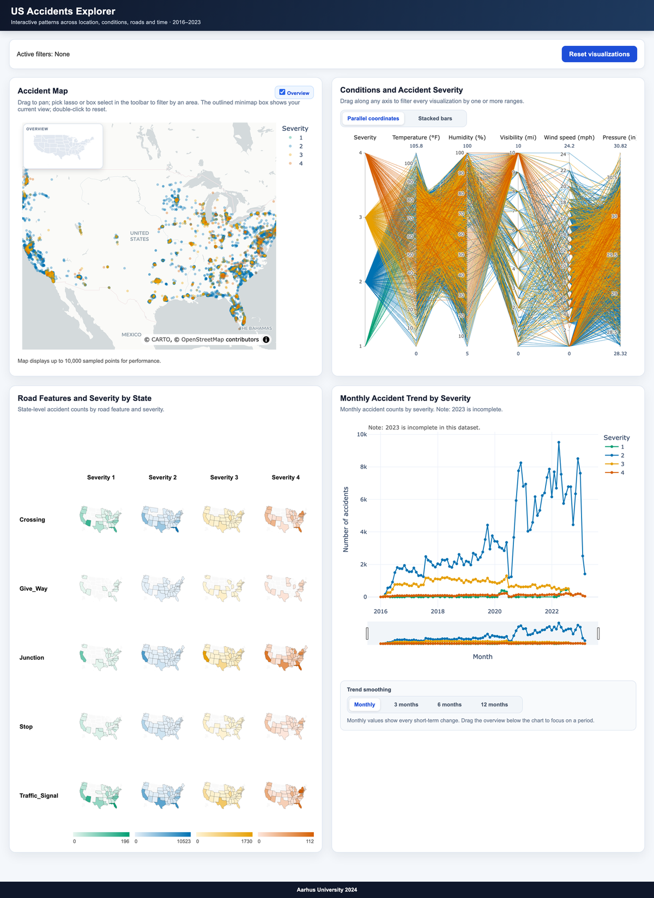
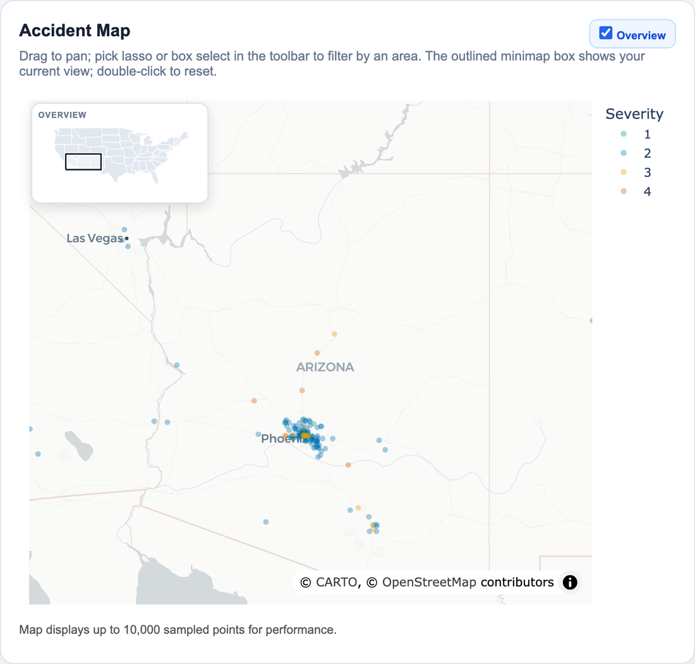
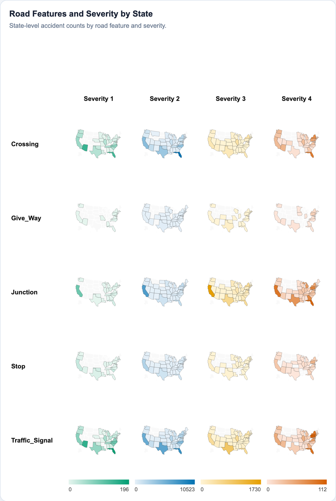
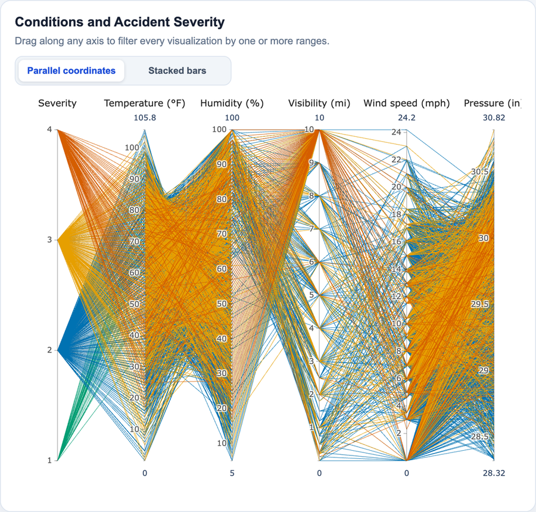
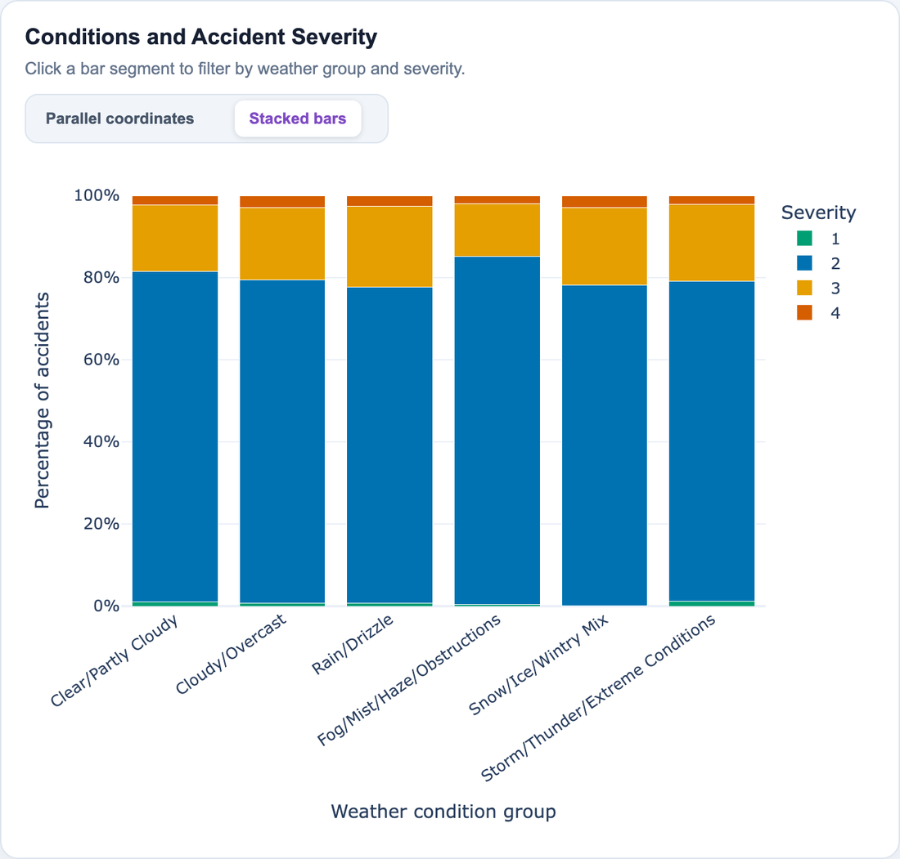
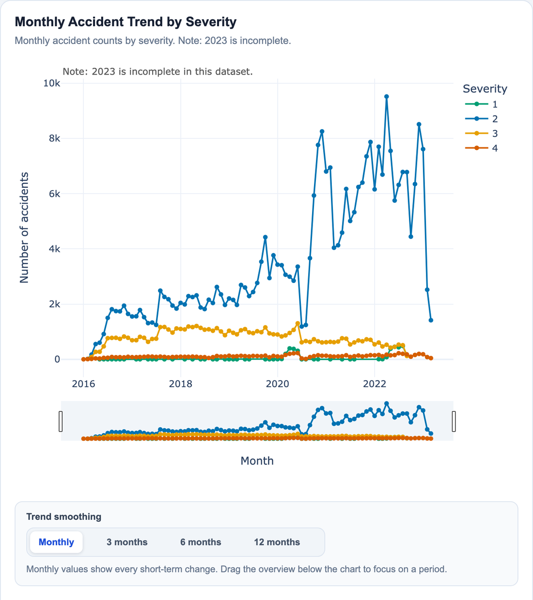

# US Accidents Visualization Dashboard

An interactive dashboard for exploring US traffic accident data from 2016 to 2023. Four linked visualizations share one filter state, so a selection made in any of them immediately narrows all the others.



## Origin

This repository is an updated and reworked version of a university data visualization project created at Aarhus University by:

- Eliasz Piotr
- Ali Al Mais
- Ibrahim Ahmed Mohammed Haras
- Xiaoyang Zhang

Original project date: December 16, 2024. Later updated and improved by **Piotr Eliasz** — the rework cleaned up the project structure, simplified running the app, and made the dashboard more usable as an analytical tool.

## Quick start

```bash
docker compose up --build
```

The container downloads the dataset if it is missing, then serves the dashboard on `http://localhost:8050`.

Application code is copied into the image, so after changing the source use `docker compose up -d --build` rather than a plain restart.

<details>
<summary>Running without Docker</summary>

```bash
pip install -r requirements.txt
python scripts/download_data.py
python main.py
```

Set `DASH_DEBUG=true` to enable Dash's debug mode.
</details>

## Layout

One screen, four cards in a two-by-two grid. Above them a bar shows the currently active filters and a **Reset visualizations** button that clears all of them at once.

---

## Accident map



A point map of accident locations on a CARTO Positron basemap, coloured by severity. Up to 10,000 points are sampled so that panning stays responsive.

Markers are drawn at 35% opacity so that overlap reads as density — coverage grows as `1-(1-α)^N`, and at this alpha the ramp keeps separating well past a dozen stacked points instead of saturating after three.

| Option | What it does |
|---|---|
| **Drag** | Pans the map. This is the default gesture. |
| **Toolbar → lasso / box select** | Draw around a group of accidents to filter every other visualization down to those exact points. The toolbar appears on hover. |
| **Click a point** | Filters by that accident's state. Clicking the same point again clears the filter. |
| **Double-click** | Returns the map to the default US-wide view. Selections are kept. |
| **Overview** (header checkbox) | Toggles the minimap in the corner. |

The minimap shows the contiguous US with the filtered state highlighted. Once you zoom past a whole-country view, an outlined rectangle marks the area you are currently looking at. It is drawn as an outline in near-black over a white ring rather than as a second blue fill, so it stays readable on top of a highlighted state, and it never shrinks below a legible size no matter how far you zoom in.

---

## Road features and severity by state



A 5 × 4 grid of state-level choropleth maps: one row per road feature (`Crossing`, `Give_Way`, `Junction`, `Stop`, `Traffic_Signal`) and one column per severity level. Each column has its own colour scale and legend, since the counts differ by an order of magnitude between severity levels.

Clicking a state in any tile filters the dashboard by that state **and** that road feature at once. Clicking the same combination again clears it.

This grid deliberately ignores the state and feature filters — if it narrowed to the selected state, a single state would be left on every tile and you could never click your way to a different one. It does respond to the time, weather and condition-range filters.

---

## Conditions and accident severity

Two views of the same weather data, switched with the toggle in the card header.

### Parallel coordinates



Severity, temperature, humidity, visibility, wind speed and pressure on parallel axes, up to 5,000 lines coloured by severity.

Drag along any axis to brush a range; the rest of the dashboard filters to it. Ranges on several axes combine, and you can hold more than one range on a single axis. Dragging a brush away clears it.

The line set itself stays put while you brush — plotly greys out what falls outside the range so that you can see what you are excluding and adjust. The other three cards show the filtered subset.

### Stacked bars



Accident counts per weather group, split by severity and normalised to percentages so that groups of very different size stay comparable.

Clicking a bar segment filters by that weather group and severity level together. The legend toggles severity levels on and off, and those toggles survive redraws.

---

## Monthly accident trend by severity



Monthly accident counts, one line per severity level.

| Option | What it does |
|---|---|
| **Range overview** (below the chart) | Drag out a period; the selection becomes a month-range filter for the whole dashboard. |
| **Click a point** | Filters down to that single month. |
| **Trend smoothing** | Switches between raw monthly values and 3-, 6- and 12-month moving averages. Changing it does not disturb the range you selected. |

Note: 2023 is incomplete in this dataset, which is why the last months drop off.

---

## Interaction model

All four visualizations read from one shared filter state. Filters of different kinds stack — a state from the map, a weather group from the bars and a month range from the trend chart all apply together, and the active-filter bar at the top always shows what is currently applied.

Every selection is a toggle: repeating it clears that filter. **Reset visualizations** returns everything, including the map viewport, to the default state.

A worked example — selecting the period 2019-01 to 2020-06 narrows every card at once:

| | no filter | 2019-01 … 2020-06 |
|---|---|---|
| map | full sample | only points from the period |
| parallel coordinates | 5,000 lines | redrawn from the period |
| stacked bars | 381,465 | 74,490 |
| monthly trend | 2016-01 … 2023-03 | 2019-01 … 2020-06 |
| road-feature grid | 142,362 | 33,022 |

## Data

The dashboard reads `data/filtereddata.parquet`, a filtered extract of the *US Accidents (2016–2023)* dataset. `scripts/download_data.py` fetches it from Google Drive on first run and skips the download if the file is already there.

Derived aggregates are cached on disk with Flask-Caching under `generated/cache/`, so repeated filter combinations do not recompute from scratch.

## Project structure

```text
apps/
  main_dashboard.py        Dash app: layout, figures and callbacks
  data_utils.py            dataset loading (Polars)
  paths.py                 shared project paths
assets/
  dashboard.css            dashboard styling
  graph_click_toggle.js    lets a repeated click toggle its filter back off
  map_dblclick_reset.js    restores double-click-to-reset on the map
scripts/
  download_data.py         dataset download
main.py                    entry point
```

Two small client-side scripts work around plotly/Dash behaviour that cannot be expressed server-side. `graph_click_toggle.js` clears `clickData` shortly after each click, because Dash does not re-run a callback when an input value is unchanged and plotly's clickData for the same mark is identical every time — without it, a second click on the same state could never toggle its filter off. `map_dblclick_reset.js` reproduces plotly's built-in map reset for the case where lasso or box select is active, since in that mode plotly takes over the subplot and the underlying map never sees the double-click.

